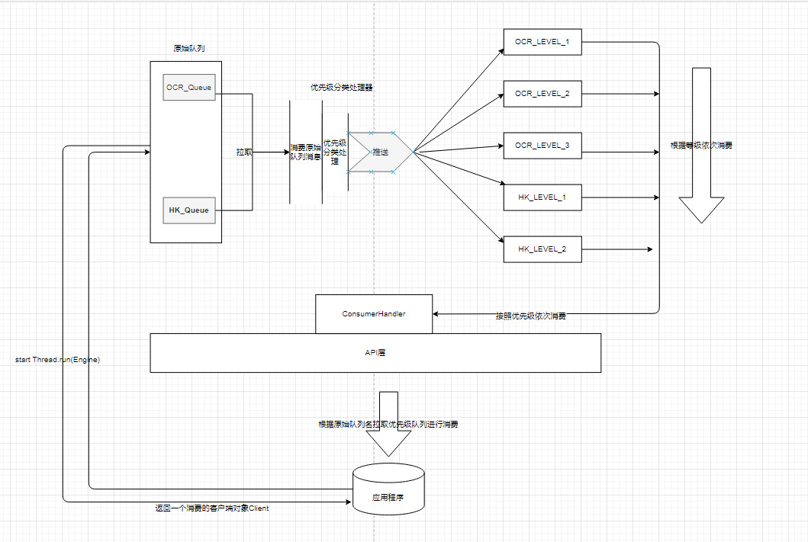
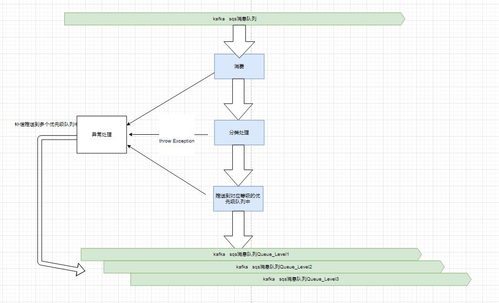

**背景：**

  **针对业务方提出：每次推送的重要分类公告都没有及时处理以及手工重推的重要消息也是这样的现象。所以就开始针对队列进行优先级划分的公共组件
开发。目前此组件支持kafka和sqs两种消息队列**

**一、架构图**

  

主要分以下几部分：

核心层：

1. 生产处理器（包含kafka和sqs生产组件）：用于管理和生产推送相关功能
2. 消费处理器 （包含kafka和sqs生产组件）：用于管理和消费拉取相关功能
3. 优先级分类处理器 （按照配置文件进行优先级 搭配生产处理器和消费处理器将原始队列消息分类推送到优先级队列中）
4. 全局锁 ：用于中断处理，当服务器重启中断后 停止消费原始队列并且继续处理之前已经消费还拉不急处理的消息

api层：客户端|自定义starter等一些注解


**二、异常处理**



**三、配置文件解读**


```yaml
- source-queue: ocr_queue #原始队列名
  queue-config: #原始队列的ip:port 以及认证信息（中台kafka需要认证信息），如果没有认证要求比如sqs队列可以不用配置queue-auth这一项
    queue-server: 192.168.47.32:9092
    queue-auth: test,test
    queue-type: kafka  # 原始队列类型（要么是kafka要么是sqs）
    consumer-group: xxx #消费组只有kafka队列需要 对于sqs可以不用配置consumer-group标签
  category-rule: #分类规则
    - level: 1 #队列等级 level值越大等级越高
      category-class: com.zhanglijie.ocrlevel1categoryserviceimpl
      target-queue: ocr_level1
      queue-config: #如果优先级队列和原始队列不在同一机器集群中，需要单独加上自己的queue-config,如果优先级队列和原始队列在同一机器集群中 可以不用单独配置自己的queue-config（比如下面的两个优先级队列以及sqs队列)
        queue-server: 192.168.87.32:9092
        queue-auth: test,test
        queue-type: kafka  # 优先级队列类型（kafka|sqs)，原则上请保证原始队列类型一致,因为原始队列和优先级队列一般都会是同类型
        consumer-group: yyy #消费组只有kafka队列需要 对于sqs可以不用配置consumer-group标签
    - level: 2
      category-class: com.zhanglijie.ocrlevel2categoryserviceimpl
      target-queue: ocr_level2
    - level: 3
      category-class: com.zhanglijie.ocrlevel3categoryserviceimpl
      target-queue: ocr_level3
- source-queue: hk_queue
  queue-config:
    queue-server: 10.0.32.25:8852
    queue-type: sqs # 原始队列类型（要么是kafka要么是sqs）
  category-rule:
    - level:
      category-class: com.zhanglijie.hklevel1categoryserviceimpl
      target-queue: ocr_level1
      #优先级队列和原始队列在统一机器集群中可以使用原始队列的queue-config,因此此处省去配置queue-config
    - level:
      category-class: com.zhanglijie.hklevel2categoryserviceimpl
      target-queue: ocr_level2
      #优先级队列和原始队列在统一机器集群中可以使用原始队列的queue-config,因此此处省去配置queue-config


      ##上述配置案例是目前最全的配置标签 不可擅自添加。但是可以减少某些配置 比如queue-config的某些配置
```


**四、接入指导**

**业务场景**：  我这里以sqs类型的消息队列举例子，比如我手上有ocr_queue（原始队列），ocr_queue_level1，

ocr_queue_level2，ocr_queue_level3这几个队列。其中ocr_queue是原始队列，然后ocr_queue_level1是最优先等级的队列，ocr_queue_level2等级次之，ocr_queue_level3等级最低。然后通过此组件完成从原始队列消费并按照业务等级分发到ocr_queue_level1，ocr_queue_level2，ocr_queue_level3这三个队列中，消费时候会自动按照优先从等级较高的队列中优先消费。


一、配置文件配置如下：

```yaml
- source-queue: ocr
  queue-config:
    queue-server: 10.10.80.226:1218
    queue-type: sqs
  category-rule:
    - level: 3
      category-class: com.zhanglijie.priorityqueue.category.ImportantCatIdCategoryServiceImpl
      target-queue: ocr_level1_queue
    - level: 2
      category-class: com.zhanglijie.priorityqueue.category.UnimportantCatIdCategoryServiceImpl
      target-queue: ocr_level2_queue
    - level: 1
      category-class: com.zhanglijie.category.OtherCategoryServiceImpl
      target-queue: ocr_level3_queue
```


二、书写分类规则类

上面配置文件中category-class对应的类就是将哪种消息分配到对应等级队列的规则类，如下：

1.将消息中uid<5000的分到ocr_level1_queue队列中：

```java
package com.zhanglijie.priorityqueue.category;
public class ImportantCatIdCategoryServiceImpl implements CategoryExecutor{

   /**
     * @param content 消息内容
     * @return 是否命中该等级队列
     */
   @Override
  public boolean hintQueueLevel(String content){
      MsgDto dto =  JsonUtils.toObj(content,MsgDto.class);
      if(dto.getUid()<5000){
         return true; //uid<5000的将命中该等级队列
      }
      return false;//否则没有命中该等级队列
  }
}
```

2.将消息中5000<uid<10000的分到ocr_level2_queue队列中


```java
package com.zhanglijie.priorityqueue.category;
public class UnimportantCatIdCategoryServiceImpl implements CategoryExecutor{

   /**
     * @param content 消息内容
     * @return 是否命中该等级队列
     */
   @Override
  public boolean hintQueueLevel(String content){
      MsgDto dto =  JsonUtils.toObj(content,MsgDto.class);
      if(5000<dto.getUid()<10000){
         return true; //uid<5000的将命中该等级队列
      }
      return false;//否则没有命中该等级队列
  }
}
```

3.将uid>10000的分到ocr_level3_queue队列中

```java
package com.zhanglijie.priorityqueue.category;
public class OtherCategoryServiceImpl implements CategoryExecutor{

   /**
     * @param content 消息内容
     * @return 是否命中该等级队列
     */
   @Override
  public boolean hintQueueLevel(String content){
      MsgDto dto =  JsonUtils.toObj(content,MsgDto.class);
      if(5000<dto.getUid()<10000){
         return true; //uid<5000的将命中该等级队列
      }
      return false;//否则没有命中该等级队列
  }
}
```

***上面的分类规则是根据自己业务来分的，大家只需要书写这个分类规则类并且通过配置文件和对应的等级队列进行绑定即可。***


三、开启组件

 1.将源代码打成maven jar包  然后应用程序依赖此jar包

 2.应用程序开启组件（我是和spring进行搭配开启）

```java
package com.zhanglijie.priorityqueue;
 
@Configuration
public class StartPriorityQueue{
   @Bean
   public PriorityQueueClient priorityQueueClient() throws Exception{
       PriorityQueueConfiguration configuration = ConfigLoader.build("priorityconf.yml");//这个yml就是上面配置文件
       return Engine.start(configuration);
        
}  
```

3. 业务层使用

   ```java
   @Service
   public class PollServiceImpl{
    @Autowired
    private PriorityQueueClient client;
    /**
    *这个传原始队列名，比如按照上面的配置，我传ocr，他就会自动优先从等级高的队列  （ocr_level1_queue）先拉取消息，如果ocr_level1_queue没有就会去拉ocr_level2_queue， 如果ocr_level2_queue没有就会去自动拉ocr_level3_queue
    */
    public String poll(String originQueueName){
        return client.pollBlocked(originQueueName);
   }
   }
   ```

   

# priority
# priority
